# COMP3121

***[use light mode]***

## Table of Contents

0. [Course Outline](#course-outline)
    - [Assessment](#assessment)
1. [Introduction](#introduction)
    - [Proofs](#proofs)
    - [Stable Matching Problem](#stable-matching-problem)
        * [Gale-Shapley Algorithm](#gale-shapley-algorithm)
2. [Divide and Conquer](#divide-and-conquer)
    - [Landau Notation](#landau-notation)
    - [Counting Inversions](#counting-inversions)
    - [Recurrences](#recurrences)
3. [Integer Multiplication I](#integer-multiplication-i)
    - [Master Theorem](#master-theorem)
    - [Arithmetic Operations](#arithmetic-operations)
4. [Integer Multiplication II](#integer-multiplication-ii)
    - [Generalising Karatsuba's Algorithm](#generalising-karatsubas-algorithm)
5. [Fast Fourier Transform](#fast-fourier-transform)
    - [Complex Numbers](#complex-numbers)
    - [The Fast Fourier Transform](#the-fast-fourier-transform)
6. [The Greedy Method](#the-greedy-method)
    - [Single Source Shortest Paths I](#single-source-shortest-paths-i)
        * [Dijkstra's Shortest Paths Algorithm](#dijkstras-shortest-paths-algorithm)
    - [Minimum Spanning Trees](#minimum-spanning-trees)
        * [Kruskal's Algorithm](#kruskals-algorithm)
        * [Union-Find](#union-find)
7. [Dynamic Programming](#dynamic-programming)
    - [Single Source Shortest Paths II](#single-source-shortest-paths-ii)
        * [Bellman-Ford Algorithm](#bellman-ford-algorithm)
    - [All Pairs Shortest Paths](#all-pairs-shortest-paths)
        * [Floyd-Warshall Algorithm](#floyd-warshall-algorithm)
8. [Maximum Flow](#maximum-flow)
    - [Flow Networks](#flow-networks)
    - [Residual Flow Networks](#residual-flow-networks)
    - [Augmenting Paths](#augmenting-paths)
    - [Solving the Maximum Flow Problem](#solving-the-maximum-flow-problem)
        * [Ford-Fulkerson Algorithm](#ford-fulkerson-algorithm)
        * [Edmonds-Karp Algorithm](#edmonds-karp-algorithm)
    - [Applications of Network Flow](#applications-of-network-flow)
    - [Bipartite Graphs](#bipartite-graphs)
9. [String Matching](#string-matching)
    - [Hashing](#hashing)
        * [Rabin-Karp Algorithm](#rabin-karp-algorithm)
    - [Finite Automata](#finite-automata)
        * [Knuth-Morris-Pratt Algorithm](#knuth-morris-pratt-algorithm)
10. [Linear Programming](#linear-programming)
    - [Weak Duality Theorem](#weak-duality-theorem)
11. [Intractability](#intractability)
    - [Feasibility of Algorithms](#feasibility-of-algorithms)
    - [Polynomial Reductions](#polynomial-reductions)
    - [Optimisation Problems](#optimisation-problems)

***

## Course Outline

### Assessment

* 4 assignments (10% each)
* Final Exam (60%)

## Introduction

* An algorithm is a collection of precisely defined steps that are executable using certain specified mechanical methods.
* By "mechanical" we mean the methods that do not involve any creativity, intuition or even intelligence.
* We deal with **sequential** (not **parallel**) and **deterministic** (not **randomised**) algorithms.

### Proofs

* Sometimes it is not obvious that an algorithm:
    - Terminates,
    - Will not run in exponentially many steps (in the size of the input), and
    - Produces a desired solution.
* Mathematical proofs are needed for such circumstances.

### Stable Matching Problem

* Suppose there are  hospitals and  doctors. Every hospital submits a list of doctor preferences and every doctor submits a list of hospital preferences.
* A **stable matching algorithm** produces a set of  pairs  for a hospital  and a doctor  so that the following never happens:
    - For two pairs  and ,
        * Hospital  prefers doctor  **and**
        * Doctor  prefers hospital .
* A stable matching always exists, but this is not obvious.

#### Gale-Shapley Algorithm

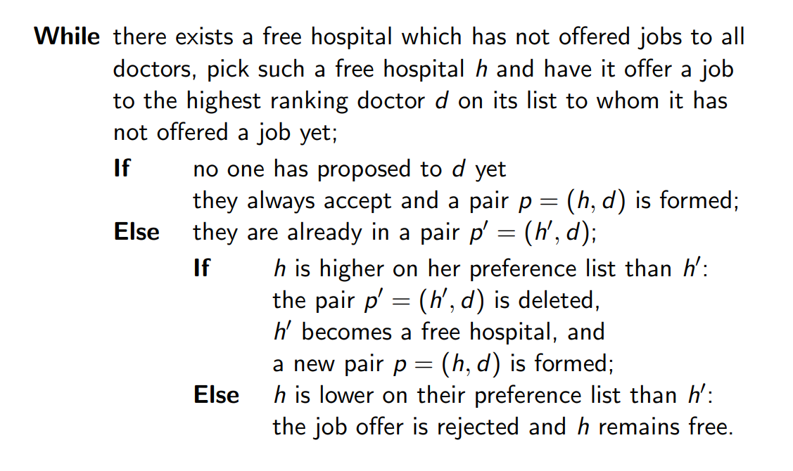

* Claims to prove:
    - The algorithm terminates after  iterations of the loop.
    - The algorithm produces a matching.
    - The matching is stable.

## Divide and Conquer

### Landau Notation

#### Big-O Notation

* We say  if there exists positive constants  and  such that  for all .
*  is said to be an **asymptotic upper bound** for .
* Useful to (over-)estimate the complexity of a particular algorithm.

#### Big- Notation

* We say  if there exists positive constants  and  such that  for all .
*  is said to be an **asymptotic lower bound** for .
* Useful to say that an algorithm runs in at least .

#### Properties

*  if and only if .
* We say  if  and . That is,  and  have the same asymptotic growth rate.
* **Sum property:**
    - If  and , then .
* **Product property:**
    - If  and , then .
    - If  and  is a constant, then .
* These properties also hold for , , , or .
* , that is, logarithms of any base are interchangeable in asymptotic notation. For this reason we typically write  instead.

### Counting Inversions

* Suppose there are  users ranking the same set of  movies. We want to determine for any two users  and  how similar their tastes are.
* Enumerate the movies on 's list. For movie  on 's list we denote the position of that movie on 's list as .

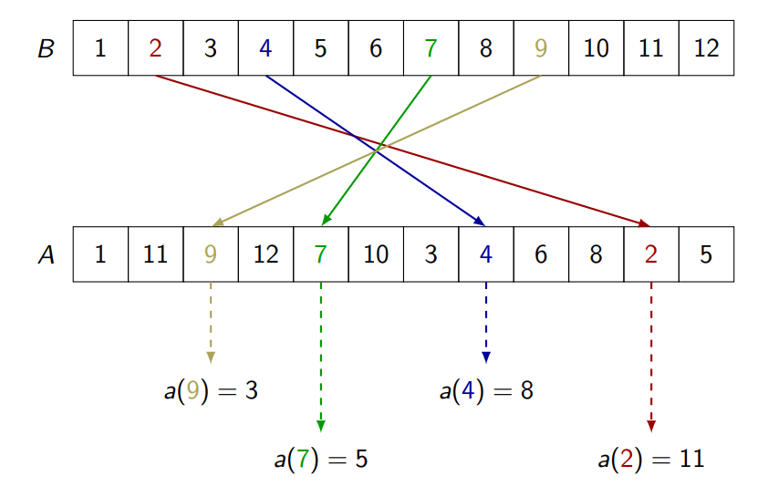

* A good measure of the degree of similarity between users  and  is to count the number of **inversions**.
* Inversions are the total number of pairs of movies ,  such that movie  precedes movie  on 's list but movie  is higher than movie  on 's list.
    - That is,  but  a(j)">.
    - For example, 4 and 7 form an inversion because .
* The brute force approach is a quadratic time algorithm . A divide and conquer approach can achieve time .
* We do a modified **merge sort** algorithm where we count inversions at the merge step.

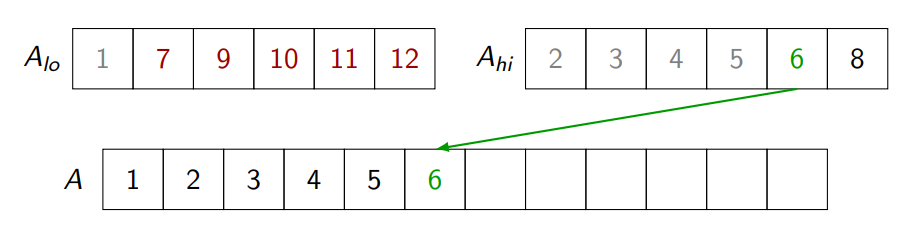

* Each time we reach an element of , each remaining element to be merged in  counts as an inversion. In this diagram, when we merge 6 there are 5 remaining elements in  so we add 5 inversions.
* We add this number of inversions (across  and ) to the number of inversions within  and  themselves.

### Recurrences

* Recurrences arise in estimations of time complexity of divide and conquer algorithms.
* Counting inversions in an array  of size  requires recursing on each half of the array ( and ) and counting inversions across the partition in linear time.
    - 
* Suppose a divide and conquer algorithm reduces a problem of size  to  many problems of smaller size  with overhead cost  to split up the problem and combine the solutions.
    - 
    - Depth of recursion 
* To estimate an algorithm's efficiency we do not need the exact solution of a recurrence. We only need the **growth rate** of the solution (asymptotic behaviour) and the approximate **sizes of the constants** involved. (**Master Theorem**)

## Integer Multiplication I

### Master Theorem

* 
* Define the **critical exponent**  and the **critical polynomial** .

#### Theorem

> 1. If  for some  0">, then .
> 2. If , then .
> 3. If  for some  0">, **and** for some  and some ,  holds for all  n_0">, then .
> 4. If none of these conditions hold, the Master Theorem is not applicable.

*  is a consequence of .

#### Example

* Let .
* The critical exponent is  so the critical polynomial is .
*  for small . (**Case 1**)
* Therefore .

### Arithmetic Operations

#### Addition

```
  C C C C C    carry
    X X X X X  first integer
+   X X X X X  second integer
-------------
  X X X X X X  result
```

* Adding 3 bits can be done in constant time and so the entire algorithm runs in linear time .
* There is no asymptotically faster algorithm to add two -bit numbers because we have to read every bit of the input.

#### Multiplication

```
        X X X X  first integer
      * X X X X  second integer
      ---------
        X X X X  O(n^2) intermediate operations:
      X X X X      O(n^2) elementary multiplications
    X X X X        O(n^2) elementary additions
  X X X X
---------------
X X X X X X X X  result of length 2n
```

* Assume two `X`'s can be multiplied in  time.
* The above procedure runs in time .
* It is not known whether we can multiply two -bit numbers in linear time.
* We can use divide and conquer to achieve faster than quadratic time.

#### Applying Divide and Conquer to Multiplication of Large Integers

* Split the two input numbers  and  into halves:
    -  - the least significant  bits.
    -  - the most significant  bits.
* 
* 
* 
* The 4 products , ,  and  can be calculated recursively in the same manner.
* Each multiplication of two  digit numbers is replaced by four multiplications of  digit numbers. With the linear overhead to shift and add: .
* The critical exponent  so the critical polynomial is . Then, . (**Case 1**)
* Therefore . We gained nothing from divide and conquer.

#### The Karatsuba Trick

* In 1960, Anatoly Karatsuba found an algorithm (later called "divide and conquer") that multiplies two -digit numbers in .
* Previously we saw that .
* But rearranging, .
    - We save one multiplication at each round of recursion.
* 3 products ,  and .
* 

## Integer Multiplication II

### Generalising Karatsuba's Algorithm

* We try dividing the numbers ,  into 3 pieces. With ,
    - , and
    - .
* The product  yields 5 coefficients and 9 products:
    - 
    - 
    - 
    - 
    - 
    - 
    - These coefficients resemble **multiplying polynomials**.
* Write  and  where  and . We seek the coefficients of .
* Let .
* Since  is of degree 4, we need 5 values to **uniquely determine** it. For simplicity, we choose .
* We reconstruct  by evaluating  and , , ,  in a similar way.
* For  we have,
    - 
    - 
    - 
    - 
    - 
    - These only involve a constant number of additions (linear time).
* We require only 5 multiplications of large -bit numbers:
    - 
    - 
    - 
    - 
    - 
* To go from these 5 values to the coefficients that we seek, we solve a system of 5 linear equations in 5 variables:
    - 
    - 
    - 
    - 
    - 
* Using Gaussian elimination,
    * 
    * 
    * 
    * 
    * 
    * These expressions do not involve any multiplications of two large numbers and thus can be done in linear  time, where  is the number of bits.
* With these coefficients, we can form the polynomial  and then compute  in linear time using bitwise shifts of the coefficients and a constant number of additions.
* Thus, we obtain  with only **5 multiplications**.
* Instead of multiplying two -bit numbers, we do 5 multiplications of -bit numbers with an overhead of additions, shifts, etc. all in linear time , so:  which by the Master Theorem gives .
* The original Karatsuba algorithm runs in  and so we got a significantly faster algorithm.

#### The General Case I

* We generalise this and slice  and  into  many slices of  bits. That is,  and  have  bits.
* 
* 
* Then, .
* As before, we form the polynomials  and  and let .
*  is of degree  so we can evaluate  at  points, say , and then reconstruct the polynomial from these values.

#### Convolution

* Define vectors  and . Then let  such that .  is said to be the **linear convolution** of  and , denoted .
* If we form polynomials with coefficients from  and , their product has coefficients given by .

#### The General Case II

* Evaluating  takes linear time  since it requires  multiplications of a -bit number  by a constant.
* We then multiply large numbers  times .
* We reconstruct these  values of  to get the coefficients of the polynomial which requires  multiplications of a constant by a large number, which is linear time.
* At the multiplication step, .
    - Each  is a -bit number.
    - Each term  has absolute value at most .
    - There are  such terms.
* Therefore,  and so . Letting , we see that the function values are -bit numbers, where  is a constant.
* We have reduced a multiplication of two -digit numbers to  multiplications of -digit numbers plus a linear overhead of additions, splitting, etc, so: .
* We ignore the constant  and apply the Master Theorem to get .
* Note that  which can be made arbitrarily close to 1 by choosing a sufficiently large .
* Therefore using a large enough number of slices allows us to get a runtime arbitarily **close to linear time**.
* However, for large , evaluating  involves an **extremely large constant factor** , resulting in a slow algorithm despite the fact that asymptotic bounds improve as  increases.
* For this reason, Python implements multiplication of large numbers only using two slices (the original Karatsuba algorithm).

## Fast Fourier Transform

#### Context

* In our strategy to multiply polynomials fast, we:
    - Evaluated  and  at  distinct points ,
    - Multiplied them point by point using  multiplications of large numbers to get  values of , and
    - Reconstructed the coefficients of .
* Previously we chose  to be the  integers  which required us to compute values such as . As the value of  increases, the value of  explodes causing a rapid increase in the computational complexity of our polynomial multiplication algorithm.
* We want to choose values for  to avoid the explosion of size when we evaluate  while computing . We would like  but this cannot be achieved with real numbers.

### Complex Numbers

* To multiply complex numbers, we multiply the moduli and add the arguments.

> If  and , then .
>
> **Corollary.**
> If , then .

#### Complex Roots of Unity

* We are interested in the solutions of , known as **roots of unity of order** .
* Solving , we see that  and .
* Let . Then , i.e. all roots of unity of order  can be written as powers of . We say that  is a **primitive root of unity of order** . Note that there are only  distinct values here, as .

>  is a primitive root of unity of order  if and only if .

* The product of two roots of unity of order  is given by  which is itself a root of unity of the same order.
* The set of all roots of unity of order ,  is closed under multiplication (and by extension, under taking powers).

> **Cancellation Lemma.**
> For all positive integers ,  and integers , .

### The Fast Fourier Transform

* Given 2 polynomials of degree at most ,  and  we evaluate  and  at  distinct points .

#### The Discrete Fourier Transform (DFT)

> * Let  be a sequence of  real or complex numbers, and let the corresponding polynomial be .
> * Let  for all , the values of  at the roots of unity of order .
> * The sequence of values  is called the **Discrete Fourier Transform (DFT)** of .

* Our polynomials  and  have degree , so the corresponding sequences of coefficients have only  terms.
* We defined the DFT of a sequence as having the same length as the original sequence and we must obtain the values at all  roots of unity of order .
* We do this by padding the sequences  and  with zeroes corresponding to the terms  since .
* The DFT  of a sequence  can be computed *very fast* using a divide and conquer algorithm called the **Fast Fourier Transform**.

#### The Fast Fourier Transform (FFT)

* We can now compute the DFTs of the two 0-padded sequences:
    - 
    - 
* For each  we multiply the corresponding values  and , obtaining .
* We then use the **inverse transformation** for DFT, called **IDFT**, to recover the coefficients  of the product polynomial  from the sequence .
* We can assume that  is a power of 2, otherwise we can pad  with zero coefficients until its number of coefficients becomes the nearest power of 2.

> For every  which is not a power of 2, the smallest power of 2 larger or equal to  is smaller than .

* **Problem.** Given a sequence , compute its DFT, i.e. find the values  at  for all  such that .
* The idea is to use divide and conquer by splitting the polynomial  into the **even powers** and the **odd powers**:
    - 
* Let us define  and . Note  is odd since we assume  is a power of 2.
    - 
    - 
    - Hence, .
    - The polynomials  and  each have  coefficients while  has  coefficients.
* We have reduced the problem from evaluating  with  coefficients to evaluating two polynomials  and  each with  coefficients at points .
* Since  is a power of 2, and hence even, we can use the cancellation lemma  to deduce that  is a root of unity of order .
    - Note  goes up to  but there are only  distinct roots of unity of order . Thus we simplify the later terms as repetitions of the earlier terms.
* We can write .
    - We have reduced a problem of size  to two such problems of size  plus a linear overhead to multiply the  terms.
*  which by **Case 2** of the Master Theorem gives  since .
* FFT is a method of replacing  many multiplications with a  procedure.

#### The Inverse Fast Fourier Transform

* The evaluation of a polynomial  at roots of unity  of order  can be represented by the matrix-vector product:


* We need a way to reconstruct the coefficients from these values.
* Since  is a square **Vandermonde matrix** with distinct rows, it is invertible, so:


> The inverse of matrix  is found by simply changing the signs of the exponents and dividing by .

* We get:


* This is not so different to the original matrix-vector product.
* The inverse FFT requires us to convert from the sequence of values , denoted by  back to the sequence of coefficients .
* To do this we use the same FFT algorithm with 2 changes:
    - The root of unity  is replaced by , and
    - The resulting output values are divided by .
* We can now compute the product  of two polynomials  and  in time .
    - Finding the DFTs  and  of  and  each run in .
    - Multiplying  and  to get  runs in .
    - Finding the IDFT of  to get  runs in .
    - Thus we can find the convolution of two -term sequences in .

## The Greedy Method

* A **greedy algorithm** is one that solves a problem by dividing it into stages, and rather than exhaustively searching all the ways to get from one stage to the next, instead only considers the choice that appears best. This obviously reduces the search space, but it is not always clear whether the locally optimal choice leads to the globally optimal outcome.
* The greedy method does not always work. Frameworks exist to determine whether a problem can be solved using a greedy algorithm.
* We focus on proving the correctness of greedy algorithms. There are two main methods of proof:
    - **Greedy stays ahead:** prove that at every stage, no other algorithm could do better than our proposed algorithm.
    - **Exchange argument:** consider an optimal solution, and gradually transform it to the solution found by our proposed algorithm without making it any worse.
* **See the example problems in [Lectures 6-8](resources/6-greedy.pdf).**
* [Proving Correctness of Greedy Algorithms](resources/proving-correctness-of-greedy-algorithms.pdf)

### Single Source Shortest Paths I

* Suppose we have a **directed graph**  with *non-negative* weight  assigned to each edge  and a designated (source) vertex .
* We want to find for every  the shortest path from  to .
* This is accomplished by a very elegant greedy algorithm developed by Edsger **Dijkstra** in 1959.

> For every vertex  on a shortest path from  to , the shortest path from  to  is just the truncation of that path ending at .

#### Dijkstra's Shortest Paths Algorithm

* The algorithm builds a set  of vertices for which the shortest path has already been established, starting with an empty set and adding one vertex at a time.
* At each stage of the construction, we add the vertex  which has the shortest path from  to  with all intermediate vertices already in .
    - The first vertex added to  is  itself, with path length zero.
* At each of  steps, we scan an array of length . We also run the constant time update procedure at most once for each edge. The algorithm therefore runs in .
    - In a *simple graph* (no self loops or parallel edges) we have  so we can simplify this to .
* A more efficient implementation using an **augmented heap** can achieve a time complexity of . Assuming the graph is connected,  so we can simplify to .

### Minimum Spanning Trees

* A minimum spanning tree  of a connected graph  is a subgraph of  (with the same set of vertices) which is a tree, and among all such trees it minimises the total length of all edges in .
* Let  be a connected graph with all lengths of edges  of  distinct and  a non-empty proper subset of the set of all vertices  of . Assume that  is an edge such that  and  and is of minimal length among all the edges having this property. Then  must belong to every minimum spanning tree  of .
* There are two famous greedy algorithms for the minimum spanning tree problem. Both algorithms build up a forest, beginning with all  isolated vertices and adding edges one by one.
* **Prim's algorithm** uses one large component, adding one of the isolated vertices to it at each stage. This algorithm is very similar to Dijkstra's algorithm, but adds the vertex closest to  rather than the one closest to the starting vertex .

#### Kruskal's Algorithm

* We order the edges  in a non-decreasing order of their weights.
* An edge  is added if its inclusion does not introduce a *cycle* in the graph constructed thus far, or discarded otherwise.
* The process terminates when the forest is connected, i.e. when  edges have been added.
* Kruskal's algorithm produces a minimal spanning tree and if all weights are distinct then such a tree is unique.
* We need to quickly determine whether a certain new edge will introduce a cycle. An edge  will introduce a cycle in the forest  if and only if there is already a path between  and , i.e.  and  are in the same connected component.

#### Union-Find

* In our implementation of Kruskal's algorithm, we use a data structure called **Union-Find** which handles **disjoint sets**. This data structure supports three operations:
    - , which returns a structure in which all elements are placed into distinct singleton sets. This operation runs in time  where .
    -  which returns the (label of the) set to which  belongs. This operation runs in time .
    -  which changes the data structure by replacing sets  and  with the set . A sequence of  initial consecutive  operations run in time .
* We do not give the runtime of a single  operation but a sequence of  consecutive such operations. Such time complexity analysis is called **amortized analysis**; it estimates average cost of an operation in a sequence of operations, in this case .
*  *initial consecutive*  operations refers to the first   operations performed after . There may be  operations between these.
*  is the vertex set  of a graph, of the form . We will label each set by one of its elements, called the *representative* of the set.
* The simplest implementation:
    - An array  such that  means that  belongs to the set with representative ,
    - An array  such that  contains the number of elements in the set with representative , and
    - An array  such that  contains pointers to the head and tail of a linked list containing the elements of the set with representative .
* If  is not the representative of any set, then  is zero and the list  is empty.
*  with two sets  and  with representatives  and  is defined as:
    - Assume  (i.e. ) otherwise perform  instead.
    - For each , update  from  to .
    - Update  to  and  to zero.
    - Append the list  to the list  and replace  with an empty list.

#### Efficient Implementation of Kruskal's Algorithm

* We first sort the  edges of graph  which takes . Since , we can rewrite this as .
* We start with  isolated vertices which will be merged into connected components until all vertices belong to a single connected component. We use the Union-Find data structure to keep track of the connected components.
* For each edge  on the sorted list of edges, we use two  operations to determine whether vertices  and  belong to the same component. If not, i.e. if  and  where , we add edge  to the spanning tree being constructed and perform  to merge the connected components containing  and .
* We perform   operations, each costing , as well as   operations which in total cost .
* The initial sorting of the edges dominates so  is the overall time complexity.

## Dynamic Programming

* The idea is to solve a large problem recursively by building from (carefully chosen) subproblems of smaller size.
* **Optimal substructure property.** We must choose subproblems so that the optimal solutions to the subproblems can be combined into an optimal solution for the full problem.
* Greedy algorithms view a problem as a sequence of stages and we consider only the locally optimal choice at each stage. Some greedy algorithms are incorrect and fail to construct a globally optimal solution. Also, greedy algorithms are unhelpful for certain types of problems, such as "count the number of ways to ...". Dynamic programming can be used to efficiently consider all the options at each stage.
* Divide and conquer used recursion to break a large problem into *disjoint* subproblems. However, dynamic programming is charcaterised by *overlapping subproblems*.
* **Overlapping subproblems property.** We must choose subproblems so that the same subproblem occurs several times in the recursion tree. When we solve a subproblem, we *store the result* so that subsequent instances of the same subproblem can be answered by just looking up a value in a table.
* A dynamic programming algorithm consists of three parts:
    - A definition of the **subproblems**,
    - A **recurrence relation**, which determines how the solutions to smaller subproblems are combined to solve a larger subproblem, and
    - Any **base cases**, which are the trivial subproblems - those for which the recurrence is not required.
* The original problem may be one of our subproblems, or it may be solved by combining results from several subproblems, in which case we must also describe this process.
* The **time complexity** of our algorithm is usually given by multiplying the *number of subproblems* by the *average time taken to solve a subproblem using the recurrence*.
* **See the example problems in [Lectures 9-11](resources/7-dp.pdf).**
* **Notation.**  is the value of  that minimises . We also have .

### Single Source Shortest Paths II

* Suppose we have a directed weighted graph  with edge weights  which **can be negative**, but without cycles of negative total weight, and a (source) vertex .
* We want to find the weight of the shortest path from vertex  to every other vertex .
* This differs to the SSSP problem solved by **Dijkstra's algorithm** because we allow **negative edge weights**, so the greedy strategy no longer works.
* We disallow cycles of negative total weight because with such a cycle, there is no shortest path. You can take as many laps around a negative cycle as you like.

#### Bellman-Ford Algorithm

> For any vertex , there is a shortest  path without cycles.
>
> It follows that every shortest  path contains any vertex  at most once, and therefore has at most  edges.

* For every vertex , let us find the weight of a shortest  path consisting of at most  edges, for each  up to .
* Suppose the path in question is , with the final edge going from  to .
* Then,  must be itself the shortest path from  to  of at most  edges, which is another *subproblem*.
* No such recursion is necessary if  or if .
* **Subproblems.** For all  and all , let  be the problem of determining , the length of a shortest path from  to  which contains at most  edges.
* **Recurrence.** For all  0"> and , .
* **Base cases.**  and for , .
* The **overall solutions** are given by .
* We proceed in  rounds (). In each round, each edge of the graph is considered only once. Therefore the **time complexity** is .
* This method is sometimes called **relaxation** because we progressively relax the additional constraint on how many edges the shortest paths can contain.
* The **SPFA (Shortest Paths Faster Algorithm)** speeds up the later rounds by ignoring some edges. This optimisation and others (e.g. early exit) do not change the worst case time complexity.
* The Bellman-Ford algorithm can be augmented to *detect* cycles of negative weight.

### All Pairs Shortest Paths

* Suppose we have a directed weighted graph  with edge weights  which can be negative, but without cycles of negative total weight.
* We want to find the weight of the shortest path from every vertex  to every other vertex .

#### Floyd-Warshall Algorithm

* Label the vertices of  as  where .
* Let  be the set of vertices allowed as intermediate vertices. Initially  is empty, and we add vertices  one at a time.
* **Subproblems.** For all  and , let  be the problem of determining , the weight of a shortest path from  to  using only  as intermediate vertices.
* **Recurrence.** For all , .
* **Base cases.** .
* The **overall solutions** are given by , where all vertices are allowed as intermediates.
* Each of  subproblems is solved in constant time, so the **time complexity** is .

## Maximum Flow

### Flow Networks

* A **flow network**  is a directed graph in which each edge  has a *positive integer* capacity  0">.
* There are two distinguished vertices: a **source**  and a **sink** ; no edge leaves the sink and no edge enters the source.

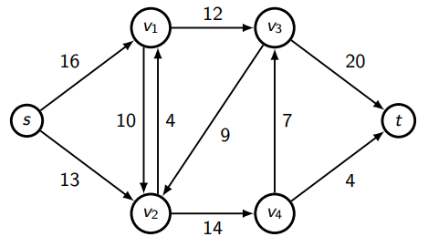

* Examples of flow networks (possibly with several sources and sinks):
    - Transportation networks
    - Gas pipelines
    - Computer networks
* A **flow** in  is a function , which satisfies:
    1. **Capacity constraint:** for all edges  we require , i.e. the flow through any edge does not exceed its capacity.
    2. **Flow conservation:** for all vertices  we require , i.e. the flow into any vertex (other than the source and the sink) equals the flow out of that vertex.
* The **value** of a flow is defined as , i.e. the flow leaving the source or equivalently the flow arriving at the sink.
* Given a flow network, our goal is to find a flow of maximum value.

> **Integrality Theorem.** If all capacities are integers (as assumed earlier), then there is a flow of maximum value such that  is an integer for each edge .

### Residual Flow Networks

* Given a flow in a flow network, the **residual flow network** is the network made up of the leftover capacities.

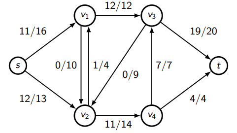
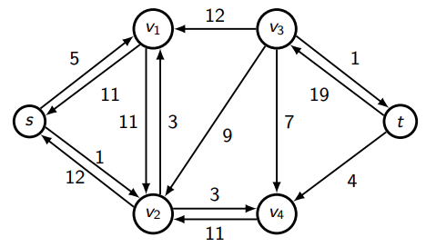

* Suppose the original flow network has an edge from  to  with capacity , and that  units of flow are being sent through this edge.
* The residual flow network has two edges:
    1. an edge from  to  with capacity , and
    2. an edge from  to  with capacity .
* These capacities represent the amount of additional flow in each direction. Note that sending flow on the "virtual" edge from  to  counteracts the already assigned flow from  to .
* Edges of capacity zero (when  or ) need not be included.
* Suppose the original flow network has an edge from  to  with capacity  and flow  units, *and* an edge from  to  with capacity  and flow  units.
* In this case, the residual flow network has edges:
    1. an edge from  to  with capacity , and
    2. an edge from  to  with capacity .
* This is because from  to , the forward edge allows  additional units of flow, and we can also send up to  units to cancel the flow through the reverse edge.

### Augmenting Paths

* An **augmenting path** is a path from  to  in the residual flow network.

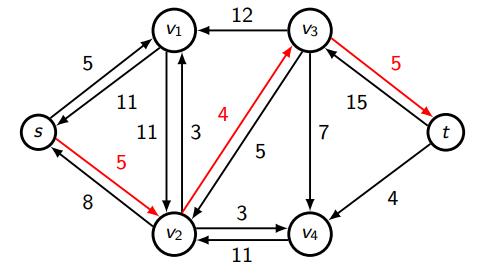

* The **capacity** of an augmenting path is the capacity of its "bottleneck" edge, i.e. the edge of smallest capacity.
* We can now send that amount of flow along the augmenting path, recalculating the flow and the residual capacities for each edge used.
* Suppose we have an augmenting path of capacity , including an edge from  to . We should:
    - cancel up to  units of flow being sent from  to ,
    - add the remainder of these  units to the flow being sent from  to ,
    - increase the residual capacity from  to  by , and
    - reduce the residual capacity from  to  by .
* For the above augmenting path, after sending 4 units of flow along this path, the new residual flow network becomes:

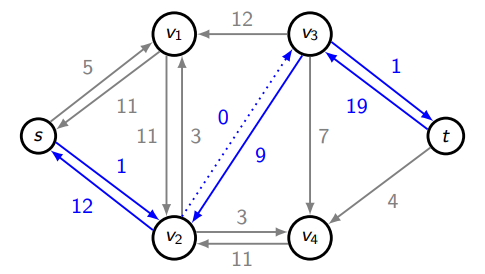

### Solving the Maximum Flow Problem

#### Ford-Fulkerson Algorithm

> * Keep adding flow through new augmenting paths for as long as it is possible.
> * When there are no more augmenting paths, you have achieved the largest possible flow in the network.

* The proof is based on the notion of a **minimal cut in a flow network**.
* A **cut** in a flow network is any partition of the vertices of the underlying graph into two subsets  and  such that:
    1. 
    2. 
    3.  and 
* The **capacity**  of a cut  is the sum of all the capacities of all edges leaving  and entering , i.e. . Note that capacities of edges going in the opposite direction (from  to ) do not count.
* Given a flow , the **flow**  through a cut  is the total flow through edges from  to  minus the total flow through edges from  to , i.e. .

> For any flow , the flow through any cut  is equal to the value of the flow, i.e. .

* An edge from  to  counts its full capacity towards , but only the flow through it towards .
* An edge from  to  counts zero towards , but minuses the flow through it from .
* Therefore, .
* It follows that , so the value of any flow is at most the capacity of any cut.

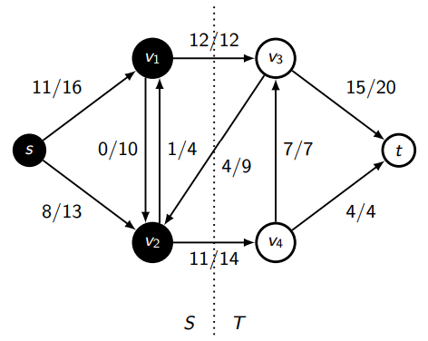

* In this example,  and .

> **Max Flow Min Cut Theorem.** The maximal amount of flow in a flow network is equal to the capacity of the cut of minimal capacity.

* Since  is at most , then if we find a flow  which equals the capacity of some cut , then such flow must be maximal and the capacity of such a cut must be minimal.

> Assume that the Ford-Fulkerson algorithm has terminated. Define  to be the source  and all vertices  such that there is a path in the residual flow network from  to . Define  to be the set of all vertices for which there is no such path. Since there are no more augmenting paths from  to , then the sink  belongs to .
>
> All the edges from  to  are fully occupied with flow, and all the edges from  to  are empty **(proof omitted)**.

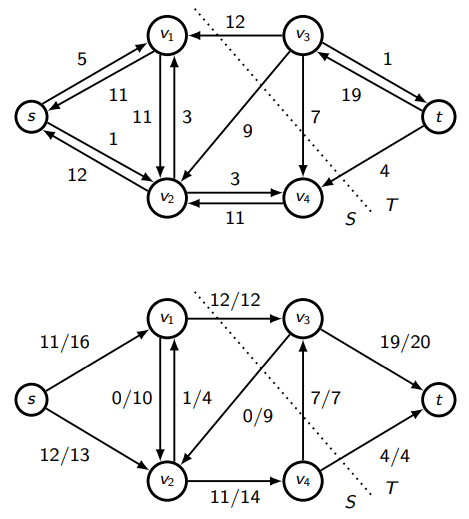

* Since all edges from  to  are occupied with flows to their full capacity, and also there is no flow from  to , then . Thus, such a flow is maximal and the corresponding cut is a minimal cut.
* The Ford-Fulkerson algorithm can potentially run in **time proportional to the value of the max flow**, which can be **exponential in the size of the input**.
* In a flow network,  otherwise there are vertices other than the source which don't have any incoming edges, or vertices other than the sink which don't have any outgoing edges. We therefore simplify  to .
* The Ford-Fulkerson algorithm has worst-case time complexity of  where  is the value of a maximum flow. In general if there are  edges in the graph, each of capacity , then  may be up to . Since the edge capacities are specified using only  bits, the algorithm does not run in polynomial time in general.
* In some circumstances the time complexity of the Ford-Fulkerson algorithm is .

#### Edmonds-Karp Algorithm

* The Edmonds-Karp algorithm improves the Ford-Fulkerson algorithm in a simple way: always choose the shortest path from the source  to the sink , where the "shortest path" means the fewest number of edges, regardless of their capacities.
* This algorithm runs in  time.
* The **fastest** max flow algorithm to date is an extension of the **Preflow-Push** algorithm and runs in time .
* The Edmonds-Karp algorithm is a specialisation of the Ford-Fulkerson algorithm, so its time complexity is also bounded by . It can be proved that it finds  augmenting paths, each in  time using BFS, so an alternative bound for its time complexity is .
* The time complexity can be written .

### Applications of Network Flow

* Flow networks with **multiple sources and sinks** are reducible to networks with a single source and single sink by adding a **super-source** and **super-sink** and connecting them to all sources and sinks respectively by edges of *infinite capacity*.

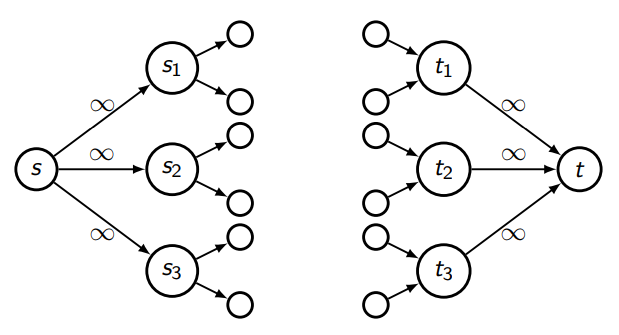

* Sometimes not only the edges but also the **vertices  of the flow graph might have capacities ** which limit the total throughput of the flow coming to the vertex and leaving the vertex: .
* We can also reduce this to a situation with **only edge capacities**. Suppose vertex  has capacity . Split  into two vertices  and . Attach all of 's incoming edges to  and all its outgoing edges from . Connect  and  with an edge  of capacity .

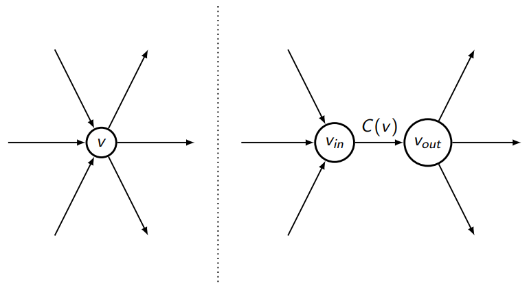

### Bipartite Graphs

> A graph  is said to be **bipartite** if its vertices can be divided into two disjoint sets  and  such that every edge  has one end in the set  and the other in the set .

* A **matching** in a graph  is a subset  such that each vertex of the graph belongs to at most one edge in .
* A **maximum matching** in  is a matching containing the largest possible number of edges.

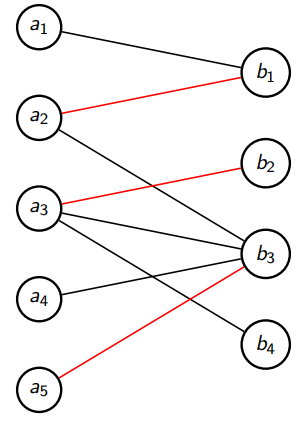

* We can turn a **Maximum Bipartite Matching** problem into a **Maximum Flow** problem: Create two new vertices  and  (the source and sink). Construct an edge from  to each vertex in , and from each vertex in  to . Orient the existing edges from  to . Assign capacity 1 to all edges.
* Since all capacities in the flow network are 1, we need only denote the *direction* of the edge in the residual graph.

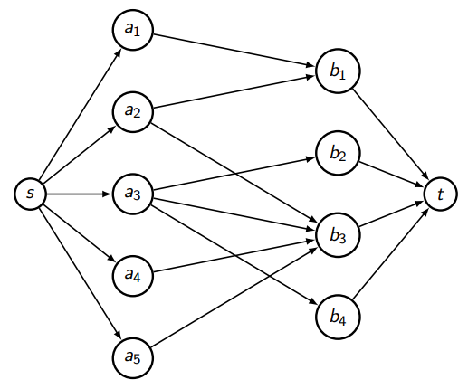
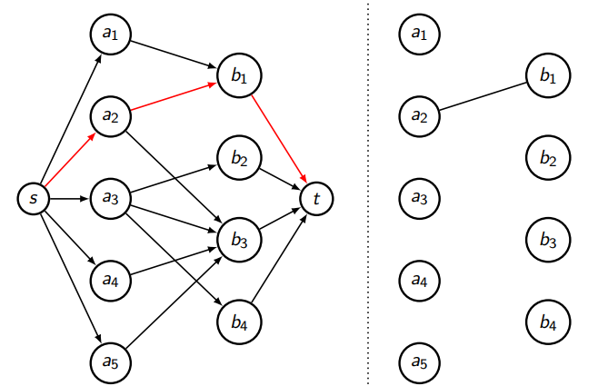

## String Matching

* Suppose you have an alphabet  of  characters.
* You want to determine whether a string  appears as a *contiguous* substring of a much longer string .
* The *naive* string matching algorithm runs in .

### Hashing

#### Rabin-Karp Algorithm

* We compute a hash value for the string  in the following way:
    - First, map each symbol  to a corresponding integer : , so as to identify each string with a sequence of these integers.
    - Then, when we refer to an integer  or , we refer to the ID of the symbol  or .
    - We can therefore identify  with a sequence of IDs , each between 0 and  inclusive. Viewing these IDs as digits in base , we can construct a corresponding integer .
    - This can be evaluated efficiently using **Horner's rule**: , requiring only  additions and  multiplications.
    - Next we choose a large prime number  and define the hash value of  as . We require that  fits in a register.
* Recall that  where .
* We want to efficiently find all  such that the string of length  of the form  and string  are equal.
* For each contiguous substring  of string  we also compute its hash value as .
* We can now compare the hash values  and  and do a symbol-by-symbol matching only if .
* Such an algorithm would only be faster than the naive symbol-by-symbol comparison only if we can compute the hash values of substrings  faster than comparing strings  and  character by character.
* We use **recursion**: we compute  efficiently from  by doing the following:
    - Since , then by multiplying both sides by  we obtain 
    - Consequently, .
    - To find , we use the precomputed value , multiply it by  and again take the remainder modulo .
    - Also, since  and  are each less than , it follows that .
    - Thus, since we chose  such that  fits in a single register, all the values and the intermediate results for the above expression also fit in a single register.
* Thus, we first compute  and  using Horner's rule.
* The  subsequent values of  for  0"> are computed in constant time using the above recursion.
*  is compared with  and if they are equal the strings  and  are compared by brute force character-by-character to confirm whether they are genuinely equal.
* Since  was chosen large, the false positives when  but  are very unlikely, which makes the algorithm **run fast in the average case**.
* However, when we use hashing we cannot achieve useful bounds for the worst case performance.

### Finite Automata

* A string matching finite automaton for a pattern  of length  has:
    -  many states  which correspond to the number of characters matched thus far, and
    - a transition function  where  and .  is the state you go to if you were in state  and then saw a character .
* Suppose that the last  characters of the text  match the first  characters of the pattern , and that  is the next character in the text. Then  is the new state after character  is read, i.e. the largest  so that the last  characters of  (ending at the new character ) match the first  characters of .
* We first suppose that  is given as a pre-constructed table. For example, if , then the table defining  would be:

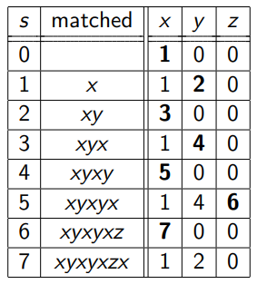
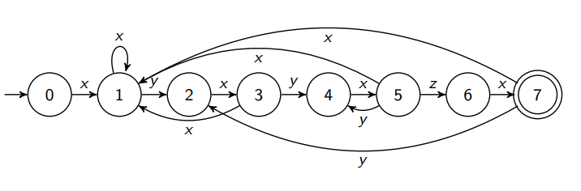

* To compute the transition function  (this table):
    - Let  denote a prefix of length  of the string .
    - Being at state  means that so far we have matched the prefix .
    - If we now see an input character , then  is the largest  such that the prefix  of string  is a suffix of the string .
    - In the particular case where , i.e. , then  and so .
    - If  however, we cant extend our match from length  to . To find , the largest  such that  is a suffix of , we match the string against itself: we can recursively compute a function  which for each  returns the largest integer  such that the prefix  of  is a proper suffix of .
    - Suppose we have already found that , i.e.  is the longest prefix of  which is a proper suffix of .
    - To compute , we first check whether .
        * If true, then .
        * If false, then we cannot extend . The next longest prefix of  which is a proper suffix of  is , so we check whether .
            - If true, then .
            - If false, then check whether , and so on...

#### Knuth-Morris-Pratt Algorithm

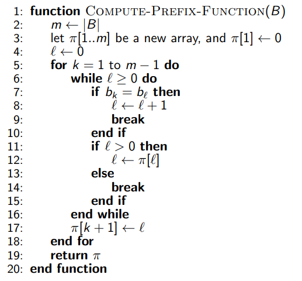

* There are  values of , and for each we might try several values .
* We maintain two pointers: the left pointer  (the start of the match we are trying to extend) and the right pointer at .
* After each step of the algorithm (i.e. each comparison between  and ), exactly one of these two pointers is moved forwards.
* Each can take up to  values, so the total number of steps is . This is an example of **amortisation**.
* The **time complexity** of this algorithm is linear .
* We can now do our search for string  in a longer string .
* Suppose  is the longest prefix of  which is a suffix of .
* To answer the same question for , we begin by checking whether .
    - If true, then the answer for  is .
    - If false, check whether ...
* If the answer for any  is , we have a match.
    - Reset to state  to detect any overlapping full matches.
* By the same two pointer argument, the time complexity is .

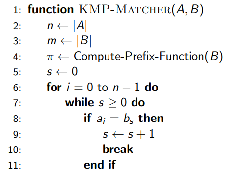
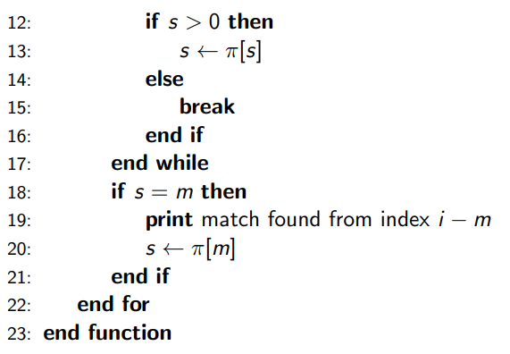

#### Looking for Imperfect Matches

* Given a very long string , a shorter string , where , and an integer , we want to find all matches for  in  which have **up to  errors**.
* We split  into  substrings of (approximately) equal length. Then any match in  with at most  errors must contain a substring which is a perfect match for a substring of .
* We look for all perfect matches in  for each of the  parts of . For every match, we test by brute force whether the remaining parts of  match sufficiently with the appropriate parts of .

## Linear Programming

* In the **standard form** the **objective** to be **maximised** is given by  and the **constraints** are of the form:
    -  &nbsp;&nbsp;&nbsp; 
    -  &nbsp;&nbsp;&nbsp; 
* To get a more compact representation of linear programs, we use vectors and matrices.
* Let  represent a (column) vector, .
* Define a partial ordering on the vectors in  by  if and only if the corresponding inequalities hold coordinate-wise, i.e. if and only if  for all .
* Write the coefficients in the objective function as , the coefficients in the constraints as an  matrix  and the RHS values of the constraints as .
* The standard form can be formulated simply as:
    - maximise 
    - subject to the following two (matrix-vector) constraints:
        * 
        * 
* Thus, a Linear Programming optimisation problem can be specified as a triplet () which is the form accepted by most standard LP solvers.
* The full generality of LP problems does not appear to be handled by the standard form. LP problems could have:
    - equality constraints,
    - unconstrained variables (i.e. potentially negative values ), and
    - absolute value constraints.
* An **equality constraint** of the form  can be replaced by two inequalities  and . Thus, we can assume all constraints are inequalities.
* Each occurrence of an **unconstrained variable**  can be replaced by the expression  where  are new variables satisfying the equality .
* For a vector , we can define . Some problems are naturally translated into constraints of the form . This also poses no problem as we can replace such **absolute value constraints** with two linear constraints:  and .
* In the standard form, any vector  which satisfies the two constraints is called a **feasible solution**, regardless of what the corresponding objective value  might be.

#### Example

* **Maximise**  subject to:
    - 
    - 
    - 
    - 
* Adding the first two inequalities gives . Since all variables are constrained to be non-negative, then we know that , i.e. the objective does not exceed 54. Can we do better?
* We try to look for coefficients  to be used to form a linear combination of the constraints:
    - 
    - 
    - 
* Summing up all these inequalities and factoring, we get .
* If we compare this to our objective, we see that if we choose  such that:
    - 
    - 
    - 
* then .
* Combining this with the above inequalities, we get .
* Consequently, in order to find a tight upper bound for our objective  in the original problem , we have to find  which solve problem :
    - **Minimise**  subject to:
        * 
        * 
        * 
        * 
* Then,  will be a tight upper bound.
* This new problem  is called the **dual problem** of .
* We repeat the whole procedure to find the dual of , denoted . We are now looking for  to obtain:
    - 
    - 
    - 
* Summing these up and factorising we get .
* If we choose multipliers  such that:
    - 
    - 
    - 
* then .
* Combining this with the above we get .
* Consequently, finding the double dual program  amounts to **maximising** the objective  subject to the constraints:
    - 
    - 
    - 
* Thus, the double dual program  is just  itself.
* Recall that the **Ford-Fulkerson algorithm** produces a **maximum flow** by showing that it terminates only when we reach the capacity of a **minimal cut**. Looking for the multipliers  reduced a maximisation problem to an equally hard minimisation problem.
* In general, the **primal** Linear Program  and its **dual**  are:

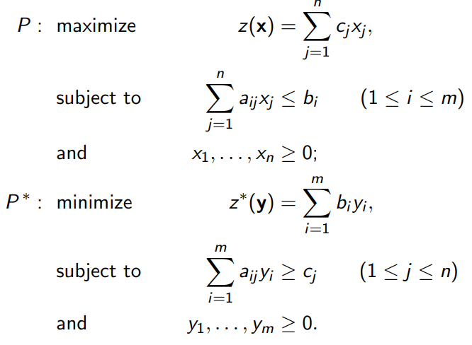
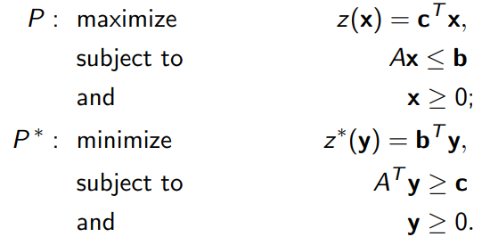

### Weak Duality Theorem

> If  is any feasible solution for  and  is any feasible solution for , then:
>
>  **(proof omitted)**.

* Thus, the value of (the objective of  for) any feasible solution of  is an upper bound for the set of all values of (the objective of  for) all feasible solutions of , and every feasible solution of  is a lower bound for the set of feasible solutions for .
* If we find a feasible solution for  which is equal to a feasible solution to , this common value must be the **maximal feasible value** of the objective of  and the **minimal feasible value** of the objective of .

## Intractability

### Feasibility of Algorithms

* A (sequential) algorithm is said to be **polynomial time** if for every input it terminates in polynomially many steps in the length of the input.
* The **length of an input** is the *number of symbols* needed to describe the input precisely.

#### Decision Problems and Class 

* A **decision problem** is a problem with a YES or NO answer.
* A decision problem  is in class  (*polynomial time*, denoted  if there exists a polynomial time algorithm which solves it.

#### Class 

* A decision problem  is in class  (*non-deterministic polynomial time*, denoted ) if there exists a problem  such that:
    1. for every input ,  is true if and only if there is some  for which  is true, and
    2. the truth of  can be verified by an algorithm running in polynomial time in the length of  only.
* We call  a **certificate** for  and  a **certifier**.
* Class  problems are problems that can be **verified in polynomial time** whereas Class  problems are problems that can be **solved in polynomial time**.
* For example, consider the decision problem  "integer  is not prime". Then we need to find a problem  such that  is true if and only if there is some  for which  is true. Naturally,  " is divisibe by ".  can indeed be verified by an algorithm running in polynomial time in the length of  only.

####  vs 

* Is it the case that *every* problem in  is also in ?
* The conjecture that  is a strictly larger class of decision problems than  is known as the "" hypothesis, and it is widely considered to be one of the hardest open problems in mathematics.

### Polynomial Reductions

* Let  and  be two decision problems. We say that  is **polynomially reducible** to  if and only if there exists a function  such that:
    1.  maps instances of  into instances of .
    2.  maps YES instances of  to YES instances of  and NO instances of  to NO instances of , i.e.  is YES if and only if  is YES.
    3.  is computable by a polynomial time algorithm.

#### Cook's Theorem

> Every  problem is polynomially reducible to the SAT problem.

* **SAT problem:**

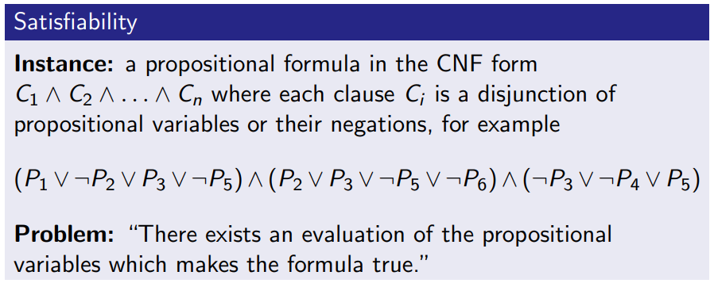

* There are  cases to consider in the SAT problem.
* The SAT problem is in class  since given an evaluation of the propositional variables one can determine in polynomial time whether the formula is true for such an evaluation.
    - If each clause  involves exactly two variables (**2SAT**), then we are in class .
* This means that for every  decision problem  there exists a polynomial time computable function  such that:
    1. for every instance  of ,  produces a propositional formula ;
    2.  is true if and only if  is satisfiable.

#### -complete

* An  decision problem  is -complete (-) if every other  problem is polynomially reducible to .
* Thus, Cook's theorem says that SAT is -complete.
* -complete problems are the hardest  problems since a polynomial time algorithm for solving an -complete problem would make every other  problem also solvable in polynomial time.
* But if  (as commonly hypothesised), then there cannot be any polynomial time algorithms for solving an -complete problem.

#### Proving -completeness

> Let  be an -complete problem, and let  be another  problem. If  is polynomially reducible to , then  is also -complete **(proof omitted)**.

#### Reducing 3SAT to VC

* We want to find a polynomial time reduction from 3SAT to **Vertex Cover (VC)**.

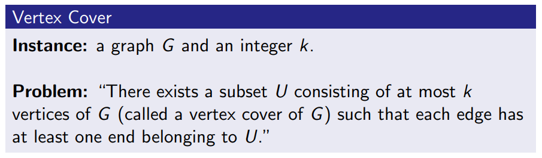
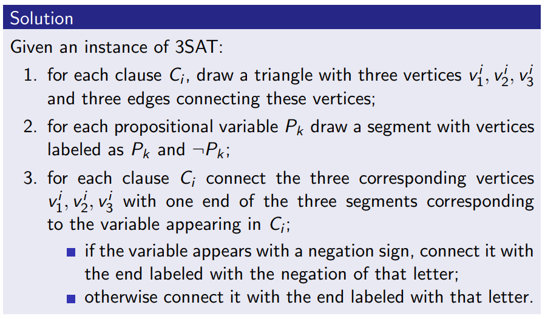

* An instance of 3SAT consisting of  clauses and  propositional variables is satisfiable if and only if the corresponding graph has a vertex cover of size at most  **(proof omitted)**.

### Optimisation Problems

#### -hard Problems

* Let  be a problem and suppose we have a "black box" device which for every input  instantaneously computes .
* We consider algorithms which are *polynomial time in *. This means algorithms which run in polynomial time in the length of the input and which, besides the usual computational steps, can also use the above mentioned "black box".
* We say that a problem  is -hard (-) if every  problem is polynomial time in , i.e. if we can solve every  problem  using a polynomial time algorithm which can also use a black box to solve any instance of .
* We do not require  to be an  problem nor a decision problem. It can also be an optimisation problem.
* It is important to be able to figure out if a problem at hand is -hard in order to know that one has to abandon trying to come up with a feasible polynomial time solution.
* All -complete problems are equally difficult because any of them is polynomially reducible to any other. However, the related **optimisation problems** can be very different. Some of these optimisation problems allow us to get within a constant factor of the optimal answer.
    - **Vertex Cover** permits an approximation which produces a cover at most twice as large as the minimum vertex cover.
    - **Metric TSP** permits an approximation which produces a tour at most twice as long as the shortest tour.
